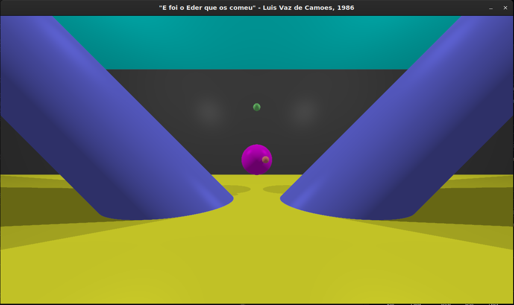

# MiniRT - 42 School Ray Tracer

**MiniRT** is a 42 School core curriculum project that implements a basic ray tracing engine in **C** using **MiniLibX**.  
It renders 3D scenes from `.rt` configuration files featuring spheres, planes, cylinders, lighting, and camera perspectives.



---

## Features

- Parses scene files with **resolution**, **camera**, **ambient light**, **point lights**, and **shapes** (mandatory: sphere, plane, cylinder).
- Implements **ray-object intersection**, **Phong shading**, **reflections**, **shadows**, and **antialiasing**
- Supports horizontal FOV, normalized orientation vectors, **RGB** colors (0–255), and brightness ratios.  
- Renders to an **X11** window via the **MiniLibX** graphics library.

---

## File Format Example

Configuration files (`.rt`) use the following structure:

```text
R 800 600                     # Resolution (width height)
A 0.2 255,255,255             # Ambient light (ratio R,G,B)
c 0,0,-20 0,0,1 80            # Camera (pos_x,pos_y,pos_z norm_vec_x,norm_vec_y,norm_vec_z fov)
l 10,10,0 0.6 255,255,255     # Light (pos_x,pos_y,pos_z ratio R,G,B)
sp 0,0,5 2 255,0,0            # Sphere (pos_x,pos_y,pos_z diameter R,G,B)
pl 0,0,-5 0,0,1 255,255,255   # Plane (pos_x,pos_y,pos_z norm_vec_x,norm_vec_y,norm_vec_z R,G,B)
cy 0,0,-5 0,1,0 3 2 255,0,0   # Cylinder (pos_x,pos_y,pos_z norm_vec_x,norm_vec_y,norm_vec_z diam height R,G,B)
```

---

## Build and Run

Clone the repository and compile according to 42’s C coding norms  
(no more than 25 lines per function, declarations at top):

```bash
git clone https://github.com/TJSilveira/42_minirt.git
cd 42_minirt
make   # Assumes you have installed MiniLibX dependencies
./minirt scenes/example.rt
```
If it does not work, try cloning MiniLibX into the project folder

**Expected output:**  
Renders the scene in a fixed sized Window.
Press **ESC** to exit.

---

## Project Structure

| Directory/File | Purpose |
|----------------|----------|
| `include/`     | Headers for vectors, rays, shapes, hits |
| `src/`         | Parsing, intersection, rendering, mlx hooks |
| `libft/`       | Custom C utility library |
| `scenes/`      | `.rt` test files |
| `Makefile`     | Compilation with `-Wall -Wextra -Werror` |

---

## Usage Tips

- Validate inputs strictly (ratios [0.0–1.0], colors [0–255], FOV [0–180]).  
- Optimize intersections using early ray termination and bounding volumes for better performance.  
- Debug with simple scenes first (e.g., one sphere + one light).

---
